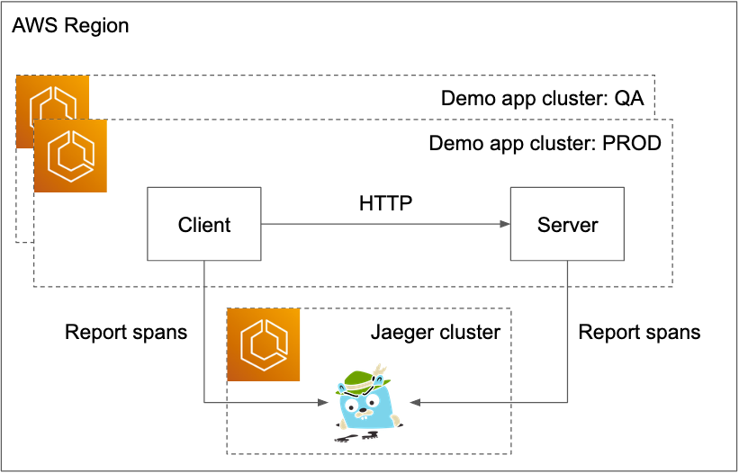

# Using Lumigo OpenTelemetry distributions with other backends

This project contains an [AWS Cloud Development Kit](https://docs.aws.amazon.com/cdk/v2/guide/home.html) (CDK) that shows how to use the Lumigo OpenTelemetry distributions for [Javascript](https://github.com/lumigo-io/opentelemetry-js-distro) and [Python](https://github.com/lumigo-io/opentelemetry-python-distro) with [Jaeger](https://www.jaegertracing.io/).


For example, notice the `aws.ecs` tags, courtesy of improved Amazon Elastic Container Service (ECS) resource detectors we have contributed upstream ([Node.js](https://github.com/open-telemetry/opentelemetry-js-contrib/pull/1083), [Python](https://github.com/open-telemetry/opentelemetry-python-contrib)).

## Architecture



## How does it work?

The [Lumigo OpenTelemetry distributions](https://docs.lumigo.io/docs/containerized-applications#lumigo-opentelemetry-distributions) are built on [OpenTelemetry](https://opentelemetry.io/).
They come with:

1. no-code installation procedures (just add a depedency and a few env vars, see the [Node.js](https://github.com/lumigo-io/opentelemetry-js-distro#setup) and [Python](https://github.com/lumigo-io/opentelemetry-python-distro#setup) installation procedures)
1. a lot of built-in automation for tracing instrumentations, resource detectors and, of course, exporting to Lumigo
1. additional, fully-automated QA in terms of compatiobility with instrumented packages

All it takes to make the Lumigo OpenTelemetry distributions work with, as in this example, Jaeger, is to add the Jaeger exporter as a dependency, and add it to the `TracerProvider` objects that the Lumigo OpenTelemetry distributions set up for you, see [Node.js example](./src/containers/server/app/app.js) and the [Python example](./src/containers/client/app/main.py).

## Requirements

* An AWS account
* AWS CDK v2 [installed and configured](https://docs.aws.amazon.com/cdk/v2/guide/getting_started.html)

## Deploy

```sh
cdk deploy --all
```

Part of the output will be something like:

```sh
$ cdk deploy --all
...
Outputs:
otelrademojaegerbackend6C6C21C6.ExportsOutputFnGetAttJaegerServiceJaeger45A2A33CDNSName17C5C95F = otelr-Jaege-SLLWJIEKEK2P-1693482168.eu-central-1.elb.amazonaws.com
otelrademojaegerbackend6C6C21C6.JaegerServiceLoadBalancerDNSJaegerA7C8F06D = otelr-Jaege-SLLWJIEKEK2P-1693482168.eu-central-1.elb.amazonaws.com
otelrademojaegerbackend6C6C21C6.JaegerServiceServiceURLJaegerhttpE552ED2E = http://otelr-Jaege-SLLWJIEKEK2P-1693482168.eu-central-1.elb.amazonaws.com  # <-- Jaeger UI url!
...
```

Then, open you shiny new Jaeger UI with the provided URL.

## Removal

Since this is an AWS CDK project, it is as easy as:

```sh
cdk destroy --all
```
